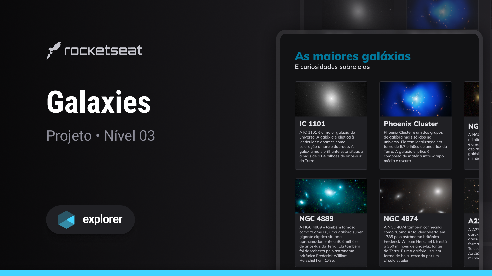

# Galaxies
Esse projeto de página com listagem de galáxias é desenvolvido no nível 03 do Explorer, curso da Rocketseat.  
Página responsiva e feita para praticar grid.

## Tecnologias usadas:
- HTML  
- CSS  
- Git

## Layout
Esse projeto foi feito a partir [desse](<https://www.figma.com/community/file/1256354736253234634/Galaxies-%E2%80%A2-Projeto-Explorer>) layout do figma.
 
